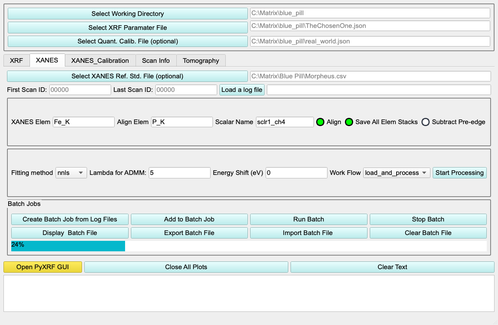
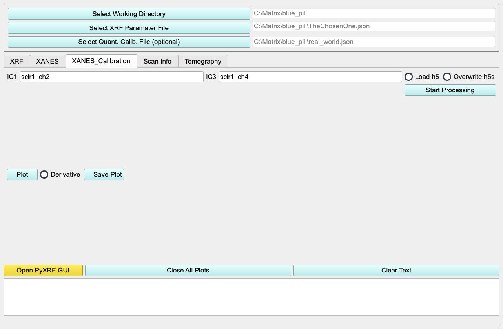
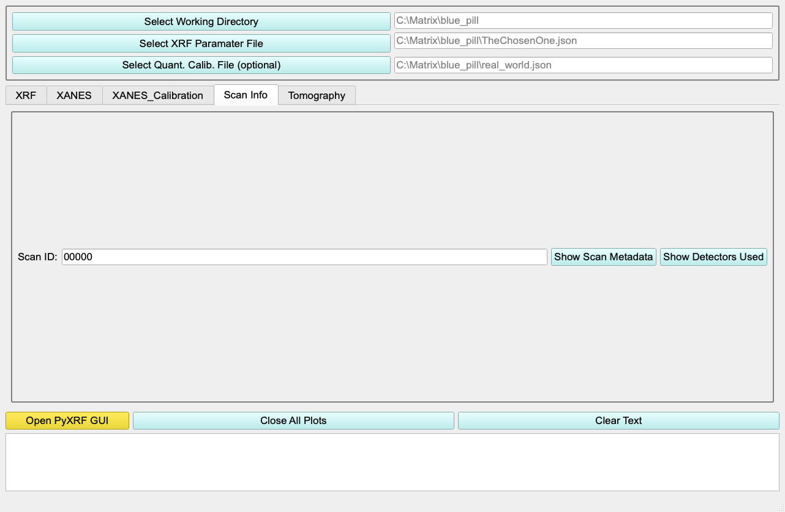
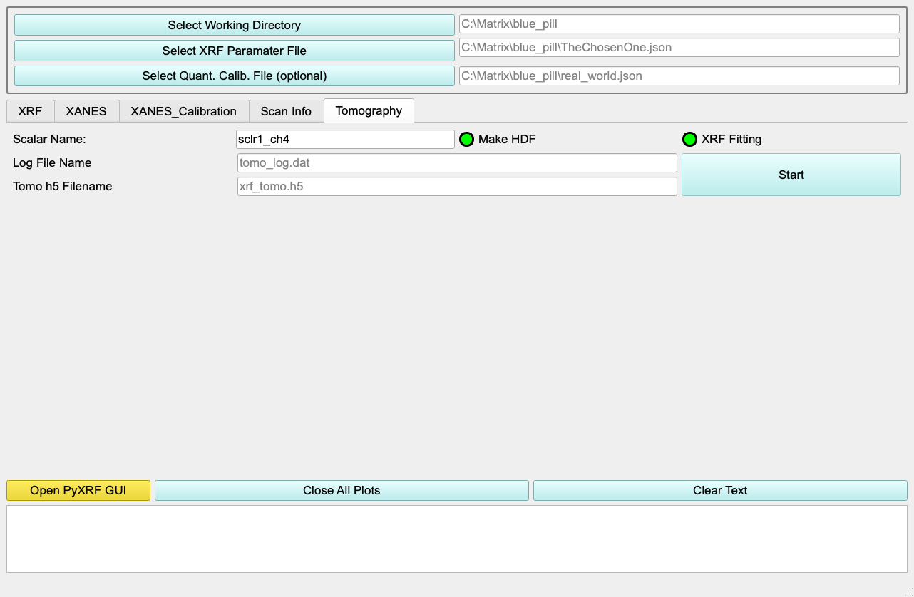

# PyXRF Batch GUI — User Guide

A task-based guide to processing X-ray fluorescence (XRF), XANES, and
tomography scans with the PyXRF Batch application (beamline 3-ID).

This guide is written to the
[U.S. Web Design System design principles](https://designsystem.digital.gov/design-principles/):
it starts with real user tasks, uses plain language, keeps a consistent
structure, and tells you honestly what each control does and how to recover
when something goes wrong.

---

## Contents

- [Who this is for](#who-this-is-for)
- [Before you begin](#before-you-begin)
- [The workspace at a glance](#the-workspace-at-a-glance)
- [Task 1: Batch-process XRF scans](#task-1-batch-process-xrf-scans)
- [Understanding the XRF options](#understanding-the-xrf-options)
- [Reading the log messages](#reading-the-log-messages)
- [Task 2: Process scans live during an experiment](#task-2-process-scans-live-during-an-experiment)
- [Task 3: Process a XANES stack](#task-3-process-a-xanes-stack)
- [Task 4: Build a XANES energy calibration](#task-4-build-a-xanes-energy-calibration)
- [Task 5: Inspect a scan (Scan Info)](#task-5-inspect-a-scan-scan-info)
- [Task 6: Reconstruct an XRF tomography dataset](#task-6-reconstruct-an-xrf-tomography-dataset)
- [Troubleshooting](#troubleshooting)
- [Appendix: Regenerating the screenshots](#appendix-regenerating-the-screenshots)

---

## Who this is for

Beamline users and staff who need to convert raw scan data into fitted XRF
element maps (and downstream XANES / tomography products) without writing
Python. If you can identify your scan numbers and your working directory, you
can use this tool.

---

## Before you begin

You will need three things for almost every task. Set them once at the top of
the window and they apply to every tab.

| You need | Where it comes from |
| --- | --- |
| A **working directory** | The folder where `.h5` files and fit results are written. |
| An **XRF parameter file** (`.json`) | Created in the PyXRF GUI; defines the elements and fit model. |
| Your **scan numbers** | From your experiment log / scan record. |

A quantitative calibration file is optional and only needed for quantified
(concentration) maps.

---

## The workspace at a glance

The three buttons across the very top stay visible on every tab. Set these
first.


1. **Select Working Directory** — choose the output folder.
2. **Select XRF Parameter File** — choose your `.json` fit parameter file.
3. **Select Quant. Calib. File (optional)** — only for quantified maps.

Below the top bar is a row of **tabs**, each a self-contained task:

| Tab | Use it to… |
| --- | --- |
| **XRF** | Turn raw scans into fitted element maps (the most common task). |
| **XANES** | Align and process an energy series into a XANES map. |
| **XANES_Calibration** | Build/inspect an energy calibration curve. |
| **Scan Info** | Look up metadata and detectors for a single scan. |
| **Tomography** | Reconstruct an XRF tomography dataset. |

The bottom of every tab has three shared controls and a **log panel**:

- **Open PyXRF GUI** — launch the full PyXRF application.
- **Close All Plots** — close every open plot window.
- **Clear Text** — empty the log panel.
- The white box below them is the **log** — read it to confirm what happened.

---

## Task 1: Batch-process XRF scans

This is the core workflow: load raw scans into PyXRF `.h5` files and fit them
into element maps.


**Steps**

1. Confirm the **working directory** and **XRF parameter file** at the top.
2. In **Scan Range**, enter your scans. You can mix ranges and single scans,
   separated by commas — for example `1234-6789,3456,234-345`.
3. In **Scalar Name**, enter the normalization scaler (e.g. `sclr1_ch4`).
4. *(Optional)* In **Quant Ref Elem**, enter the reference emission line
   (e.g. `Cu_K`) if you are producing quantified maps.
5. Set the six option toggles for the run — see
   [Understanding the XRF options](#understanding-the-xrf-options) below.
6. Select **Start Batch Processing**.
7. Watch the **log panel** for per-scan status and a final summary.

**To stop early:** select **Stop Batch Processing**. The current step finishes,
then the run stops cleanly and reports where it stopped — you will not corrupt
existing files.

---

## Understanding the XRF options

These six toggles control what a run actually does. They are independent — turn
each on or off as needed.

| Toggle | When ON | When OFF |
| --- | --- | --- |
| **Make HDF** | Create the PyXRF `.h5` file from raw data first. | Skip loading; fit `.h5` files that already exist. |
| **XRF Fitting** | Fit the data into element maps. | Only create `.h5` files; do not fit. |
| **Overwrite Existing** | Rebuild an `.h5` even if it already exists. | Reuse an existing `.h5` (faster; nothing is lost). |
| **Save as tiff** | Also export element maps as TIFF images. | Keep results in the `.h5`/output only. |
| **Interpolate to uniform grid** | Resample maps onto a regular grid. | Keep the raw scan positions. |
| **Skip 1D** | Ignore 1-D fly scans (`FlyPlan1D`, `1D_FLY_PANDA`). | Attempt every scan in the range. |

**How Make HDF and XRF Fitting combine**

| Make HDF | XRF Fitting | Result |
| --- | --- | --- |
| ✓ | ✓ | Load each scan to `.h5`, then fit it. |
| ✓ | ✗ | Load `.h5` files only — no fitting. |
| ✗ | ✓ | Fit existing `.h5` files; scans with no `.h5` are skipped. |
| ✗ | ✗ | Nothing runs. |

**How Overwrite Existing behaves (with Make HDF on)**

- **Overwrite off + `.h5` already exists** → the file is **reused** (not
  recreated and not treated as an error), and it is still fit if XRF Fitting is
  on.
- **Overwrite on + `.h5` exists** → the file is rebuilt from raw data.
- **`.h5` missing** → it is created regardless of the Overwrite setting.

---

## Reading the log messages

The log panel reports one line per scan so you always know the true outcome —
"done" never hides a failure. Tags:

| Tag | Meaning |
| --- | --- |
| `[LOAD OK]` | An `.h5` file was created. |
| `[LOAD REUSED]` | An existing `.h5` was reused (Overwrite was off). |
| `[LOAD SKIPPED]` | Scan intentionally not loaded (incomplete, 1-D, or filtered type). |
| `[LOAD FAILED]` | Loading raised an error; the message says why. |
| `[FIT OK]` | Fitting produced output for that scan. |
| `[FIT SKIPPED]` | No `.h5` available to fit, or output already present. |
| `[FIT FAILED]` | Fitting raised an error or produced no output. |

Each run ends with a summary line, for example:

```
h5 load summary: 8 available (created/reused), 2 skipped, 1 failed
fit summary: 8 fitted, 1 failed
  fit failed scans: [433971]
```

If you see failures, the listed scan numbers tell you exactly which ones to
re-run or investigate.

---

## Task 2: Process scans live during an experiment

The **Live XRF Processing** section (lower half of the XRF tab) processes scans
as they are collected.

- **Load Live Tracking File** → point to the tracking file your experiment
  writes, then **Start Live Tracking** / **Stop LiveTracking**.
- **Load Multiple Tracking Files (Offline)** → replay several tracking files,
  then **Start Processing** / **Stop Processing**.
- **Start Live** / **Stop Live** → begin/end continuous processing.
- **Chunk Size** → how many scans are processed per iteration.
- **Current Scan** and **Last Processed** show progress; **Failed XRF Fits**
  lists scans that need attention.

The same option toggles and log messages from Task 1 apply here.

---

## Task 3: Process a XANES stack

Use the **XANES** tab to align an energy series and build a XANES map.



**Steps**

1. Set **First Scan ID** and **Last Scan ID**, or select **Load a log file** to
   populate them.
2. *(Optional)* **Select XANES Ref. Std. File** for a reference standard.
3. Enter the **XANES Elem** (element to map, e.g. `Fe_K`), the **Align Elem**
   (element used for image alignment), and the **Scalar Name**.
4. Choose the toggles: **Align**, **Save All Elem Stacks**, **Subtract
   Pre-edge**.
5. Pick a **Fitting method** (`nnls` or `admm`), a **Work Flow**
   (`load_and_process`, `process`, or `build_xanes_map`), and set **Lambda for
   ADMM** / **Energy Shift (eV)** if needed.
6. Select **Start Processing**.

**Batch Jobs** lets you queue several XANES jobs: **Create Batch Job from Log
Files**, **Add to Batch Job**, **Run Batch** / **Stop Batch**, and
import/export/clear the batch file. The progress bar shows batch completion.

---

## Task 4: Build a XANES energy calibration

Use the **XANES_Calibration** tab to generate and inspect an energy calibration
curve.



**Steps**

1. Enter the ion-chamber scalers **IC1** and **IC3**.
2. Choose **Load h5** to (re)load data; enable **Overwrite h5s** only if you
   want to rebuild existing files.
3. Select **Start Processing**.
4. Use **Plot** to view the curve, **Derivative** to plot its derivative, and
   **Save Plot** to save the calibration data to a text file.

---

## Task 5: Inspect a scan (Scan Info)

Use the **Scan Info** tab to look up a single scan without processing it.



**Steps**

1. Enter a **Scan ID**.
2. Select **Show Scan Metadata** to print the scan's metadata to the log, or
   **Show Detectors Used** to list its detectors.

This is a quick, read-only way to confirm you have the right scan before a batch
run.

---

## Task 6: Reconstruct an XRF tomography dataset

Use the **Tomography** tab to build a tomography HDF file and fit it.



**Steps**

1. Enter the **Scalar Name** for normalization.
2. Toggle **Make HDF** and **XRF Fitting** as needed (same meaning as Task 1).
3. Set the **Log File Name** (e.g. `tomo_log.dat`) that lists the projection
   scans, and the output **Tomo h5 Filename** (e.g. `xrf_tomo.h5`).
4. Select **Start**.

---

## Troubleshooting

| Symptom | Likely cause | What to do |
| --- | --- | --- |
| A run reports scans under `[LOAD FAILED]` | Scan not in databroker, or incomplete | Re-check the scan number; confirm the scan finished. |
| Scans show `[LOAD SKIPPED] … 1D` | 1-D fly scans excluded by **Skip 1D** | Expected; turn off **Skip 1D** to include them. |
| `[FIT SKIPPED] … no h5` in fit-only mode | No `.h5` exists yet for that scan | Enable **Make HDF**, or load the `.h5` first. |
| Existing `.h5` files are being rebuilt | **Overwrite Existing** is on | Turn it off to reuse files and save time. |
| Fitting seems to run when you only wanted `.h5` | **XRF Fitting** is on | Turn off **XRF Fitting** to create `.h5` only. |
| Nothing happens on Start | Both **Make HDF** and **XRF Fitting** are off | Enable at least one. |

If a run stops responding, use **Stop Batch Processing**, then read the log to
see the last scan reported before restarting from that scan number.

---

## Appendix: Regenerating the screenshots

The images in this guide are rendered directly from the Qt layout file
`xrf_xanes_3ID_gui.ui`, so they can be refreshed whenever the UI changes. They
were produced offscreen (no live beamline connection required):

```bash
# Isolated environment, so your working env is untouched
python -m venv /tmp/uirender
/tmp/uirender/bin/python -m pip install PyQt5

# Render every tab to docs/images/
QT_QPA_PLATFORM=offscreen /tmp/uirender/bin/python docs/render_ui.py \
    src/pyxrf-batch/xrf_xanes_3ID_gui.ui docs/images
```

The helper script (`docs/render_ui.py`) iterates the tab widget, selects each
tab, and saves it with `QWidget.grab()`.
